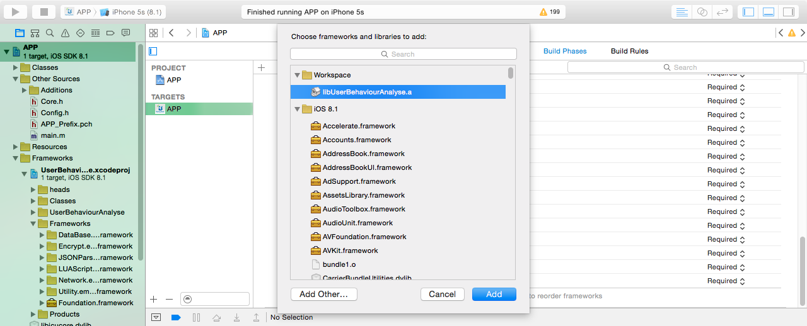
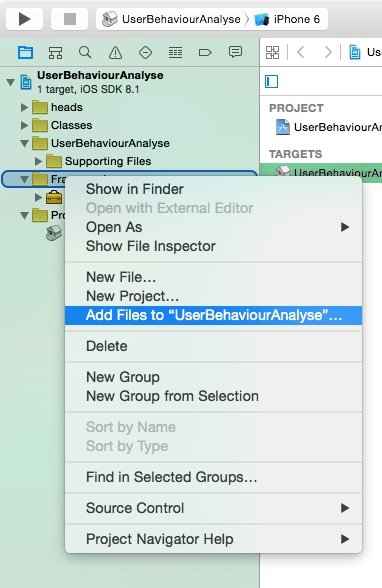

#功能扩展之统计分析使用指南

##概述
借助于此功能扩展，我们可以统计和分析移动应用的流量来源、内容使用、用户属性和行为数据等，以便进一步利用该数据进行产品、运营、推广策略的决策。

##后台支持
此功能扩展要求统计后台**MDAP**的**SDK**为**2.0**版本及以上。

##使用

### 代码获取
在获得授权后，请前往<https://dev.rytong.me:9998/hg/proj/mdap/sdk-iOS>获取iOS平台统计分析客户端代码。其工程名为**UserBehaviourAnalyse.xcodeproj**。

###代码导入
请将**UserBehaviourAnalyse.xcodeproj**导入你的工程中，并在`build Phases`中添加静态库，如下图：


### 依赖库添加
**UserBehaviourAnalyse.xcodeproj**工程依赖于以下静态库：

* DataBase.framework
* Encrypt.framework
* JSONParser.framework
* LUAScript.framework
* Network.framework
* Utility.framework

在以合法身份获取上述静态库后，请按下图添加上述静态库至工程中：



添加上述静态库后，**command+B**编译确保编译无错误。

### 使用

####config.h文件
请在工程配置文件config.h文件中添加如下代码

```
//设置是否开启统计功能
#ifndef START_USER_BEHAVIOUR_ANALYSE
    #define START_USER_BEHAVIOUR_ANALYSE
#endif
```
当该宏开启时，将开启统计分析功能。否则关闭。
####RYTConfig.h
请在RYTConfig.h文件中添加如下代码：

```
//是否开启用户行为统计功能
- (BOOL) needToStartUserBehaviourAnalyseFunction;
```
####RYTConfig.m
请在RYTConfig.m文件中添夹如下代码：

```
- (BOOL) needToStartUserBehaviourAnalyseFunction {
#ifdef START_USER_BEHAVIOUR_ANALYSE
    return YES;
#else
    return NO;
#endif
}
```
#### 其他
在**UserBehaviourAnalyse.xcodeproj**工程中，有名为**UserBehaviourAnalyseConfig.h**的文件，此文件为统计分析的配置文件，其宏定义描述如下：

```
#pragma mark -
#pragma mark 统计功能
/**
 * 统计功能开关
 * 通过START_USER_BEHAVIOUR_ANALYSE控制统计功能的开启与关闭
 * 如果需要开启统计功能,则打开此宏定义.反之,关闭.
 * 统计功能的使用参阅bankdemo.
 */
#define START_USER_BEHAVIOUR_ANALYSE
//统计功能设置
#ifdef START_USER_BEHAVIOUR_ANALYSE
/**
 * 统计功能设置相关内容
 * 如果START_USER_BEHAVIOUR_ANALYSE打开,下面的设置才会生效.
 */
/**
 * 设置该应用程序的apiKey
 * 关于apiKey的内容参阅统计分析相关文档
 */
#define API_KEY @"90187UQK"
/**
 * 设置该应用程序的下载渠道
 * MDAP 要求该值是可配置的
 * 关于channel的内容参阅统计分析相关文档
 */
#define CHANNEL @"App Store"
/**
 * 统计SDK版本号
 */
#define API_VERSION @"2.0"
/**
 * 统计服务器
 * 收集到的用户信息,将会发送到此服务器.
 */
#define USER_BEHAVIOUR_ANALYSE_SERVER_URL @"http://192.168.64.127:4007"
/**
 * 向服务器发送统计数据时,需要在url中加入appName参数,
 * TRACK_APP_NAME用来定义appName的值.
 * 关于appName的项目信息参阅统计分析相关文档
 */
#define TRACK_APP_NAME @"stats"
/**
 * 设置统计数据使用的加密方式
 * 目前仅支持两种加密方式:emp信道 or 移位加密（二者择一）
 * ENCRYPT_METHOD_EMP 表示emp信道加密
 * ENCRYPT_METHOD_OFF_SET 表示通过移位加密
 * 关于两种加密的详细内容参阅统计分析相关文档.
 */
//#define ENCRYPT_METHOD_EMP
#define ENCRYPT_METHOD_OFF_SET

/**
 * 统计数据的发送接口,它将与USER_BEHAVIOUR_ANALYSE_SERVER_URL
 * 组合生成发送路径.
 * 如果使用信道加密,数据的发送接口为stats/collect_s.
 * 如果使用移位加密,数据的发送接口为stats/collect.
 */
#ifdef ENCRYPT_METHOD_EMP
#define ANALYSE_DATA_REQUEST_URL @"stats/collect_s"
#else
#define ANALYSE_DATA_REQUEST_URL @"stats/collect"
#endif
/**
 * 是否在收集报错信息时仍弹出报错提示,建议在生产环境中打开此宏定义.
 * 如果定义此宏，在开启开发错误提示的情况下，
 * 将只是收集错误信息不会再弹出错误提示框.
 */
#define ONLY_COLLECT_AND_DONOT_SHOW
#endif
```
上述文件可以根据需求灵活配置
